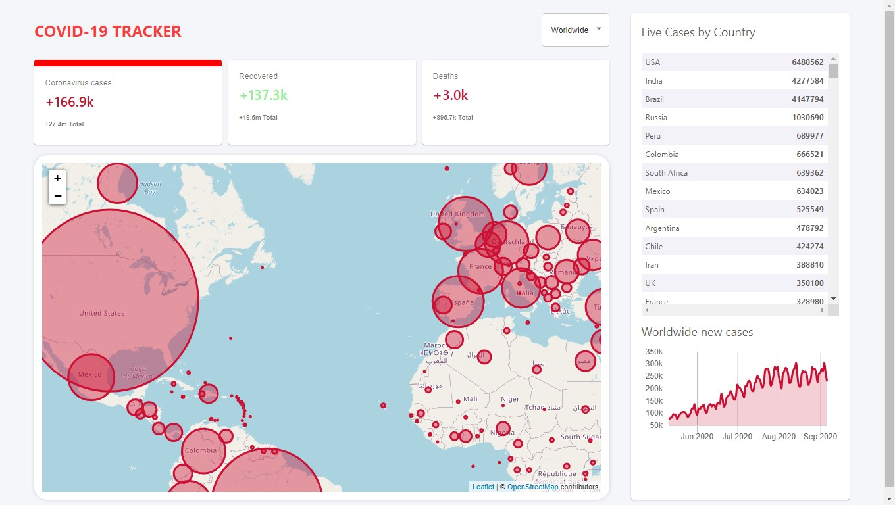

# Covid-19 Tracker App

[https://covid-19-tracker-a0fe1.web.app/](https://covid-19-tracker-a0fe1.web.app/)

A react based app to show the latest situation of covid-19 throughout the world. Has functionality to search by countries and shows separate markers for attacked, deceased and cured.

## Features
- UI unique
- Uses graph to show the overall situation
- Uses API data to hsow the results

## Technologies
- React
- Covid-19 Api
- Bootstrap
- google map API
- Firebase Database
